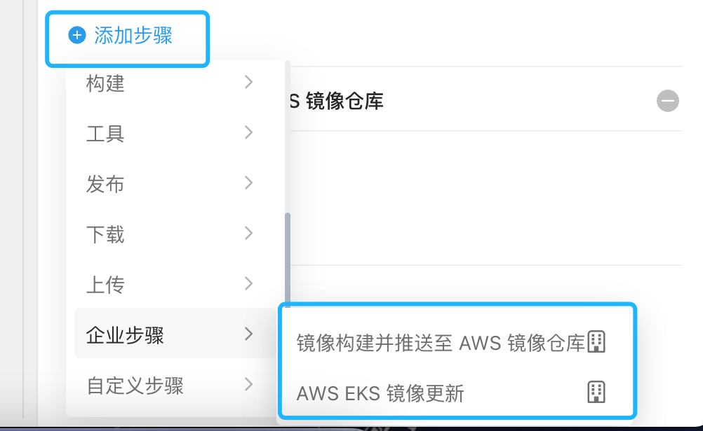
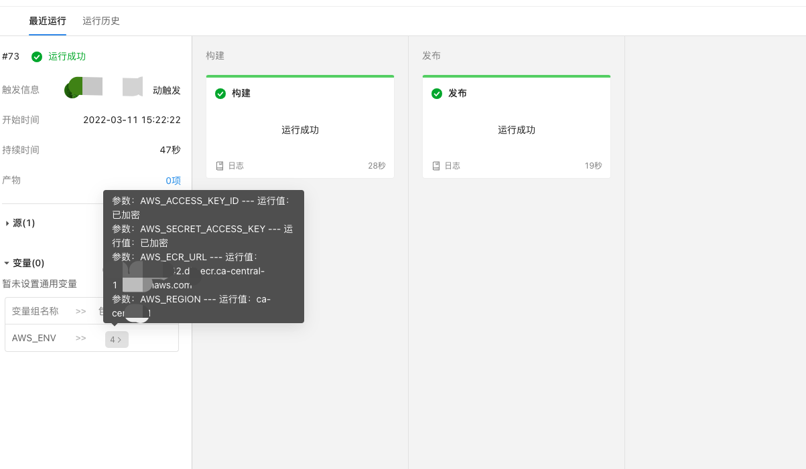

# OTT 流水线插件

* aws_ecr_push: 镜像构建并推送至 AWS 镜像仓库
* aws_eks_update_image: AWS EKS 镜像更新

## 背景

在 AWS 提供的 EKS (aws 托管的 k8s) 与 ECR (aws 提供的镜像服务)中，官方提供的登录方式，都是使用有有效期限制的登录凭据，[EKS 为 15 分钟](https://aws.github.io/aws-eks-best-practices/security/docs/iam/)，[ECR 为 12 小时](https://docs.anchore.com/3.0/docs/using/cli_usage/registries/ecr_configuration/)。

这种情况下，无法直接和现有的[云效流水线](https://help.aliyun.com/document_detail/153678.html)（以下称流水线）兼容，即标准[构建容器镜像](https://help.aliyun.com/document_detail/202411.html)与[Kubernetes镜像升级](https://help.aliyun.com/document_detail/160072.html)。

因此尝试了以下两种方案：

1. 尝试了使用流水线的[自定义步骤](https://help.aliyun.com/document_detail/202431.html)，流水线的自定义步骤的原理是，使用自定义的镜像，运行脚本。然而在第一环节，即构建容器镜像环节，就碰到了绕不开的坎，也就是 Docker 里面跑 Docker ([Docker In Docker](https://zhuanlan.zhihu.com/p/27208085))，流水线出于安全考虑，公有环境的构建集群不会支持这种方式, [自有构建集群](https://help.aliyun.com/document_detail/201868.html)能支持。

2. 流水线如果提供了更新 K8s 配置与 更新镜像服务配置的 API， 那么我们可以使用定时任务的方式，或者前置步骤更新的方式兼容，这种方式，能利用标准的流水线步骤，不过目前流水线还不支持。

因此选择了第一种方式，即开发 AWS 构建与发布插件与 EKS 镜像更新插件。

## 原理 

使用带有 [AWS Cli](https://aws.amazon.com/cn/cli/) 的环境，配置好 AWS 的认证方式，然后再执行相应的构建过程。

## 使用方式

### AWS 环境配置

两个插件均需要配置 AWS CLI 需要用到的环境变量

* `AWS_ACCESS_KEY_ID` 即 AWS 中的 `ACCESS_KEY_ID`
* `AWS_SECRET_ACCESS_KEY` 即 AWS 中的 `SECRET_ACCESS_KEY`
* `AWS_REGION` 为 AWS 所在的区域

### 镜像构建并推送至 AWS 镜像仓库

* 配置环境变量镜像仓库的地址 `AWS_ECR_URL`
* 在步骤中，填写 `镜像名称`、`Dockerfile 路径`、`ContextPath` 即可。
* 任务会输出 `镜像构建并推送至 AWS 镜像仓库.镜像名称`，镜像的 Tag 为构建时间格式 `yyyy-MM-dd-HH-mm-ss` 的字符串。

**注意**: 只能选择[自有构建集群](https://help.aliyun.com/document_detail/201868.html)。

### AWS EKS 镜像更新

* 需要在新的阶段中，添加此步骤，因为流水线的步骤之间的参数传递需要跨阶段。
* 填写好 `EKS集群名称`、`EKS 命名空间`、`Workloads 类型`、`Workloads 名称`、`容器名称`、`镜像`（镜像构建并推送至 AWS 镜像仓库步骤输出的 `镜像构建并推送至 AWS 镜像仓库.镜像名称`）字段的值。

## 如何开发

* [下载](https://help.aliyun.com/document_detail/153811.html)与自己本地开发环境匹配的 flow cli，把 flow 命令放在系统 PATH 中
* 本地拥有 docker 环境
* 把 `step.yaml` 中的镜像名称，修改成自己能上传的公共镜像仓库镜像名称
